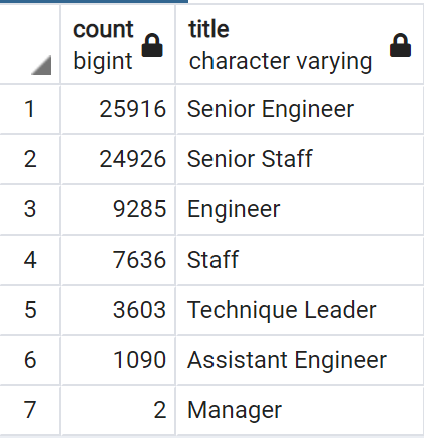
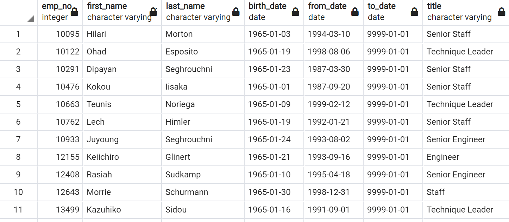

# Pewlett_Hackard_Analysis  
## Overview of the project  
This anyalysis was conducted towards the employees data of Pewlett Hackard, in an effort to summarize the number of retiring employees from each job title and the number of experienced staffs who can join to help mentor the next generation. 
The analysis was brought out by SQL, with the statement of JOIN, WHERE, SORT BY, GROUP BY and DISTINCT ON to create new tables which reflects the key informations for decision making.

## Results
  
From the summary table retiring_titles, we can conclude that:
* There are 7 job titles getting affected by this "silver tsunami".
* The job titles that are affected the most are "Senior Engineer" and "Senior Staff", with an amount of 25916 and 24926 employees retiring. 
* 2 managers are also approaching to retirment.  
  
From the Mentorship Eligibility table generated through this analysis, we can summarize the following finding:  
* The candidates who are qualified for mentorship program are from different backgroud/titles. They can potentially help with the training and transition of junior employees to senior roles.  

## Summary
There are 7 different job titles that have employees retiring soon, with a total of 72,458 retirees. Out of all those retirees, 50842 of them (up to 70.17%) are holding senior positions. With the exisiting situation, there are 1549 qualified mentorship candidates, which is a much smaller group compared to the number of retirees. Based on the circumstances, Pewlett Hackard will need to invest in a lot to hire senior engineers and staff, with putting in heavy focus on developing existing employees to fastern their process to senior roles.
